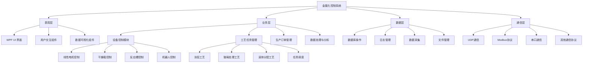

# 金属化控制系统 (Metalization System)

## 项目简介

金属化控制系统是一个基于WPF开发的工业自动化控制软件，用于管理和监控金属化生产过程中的各种设备和工艺参数。该系统提供了直观的用户界面，支持设备控制、工艺任务管理、数据采集与分析、生产订单管理等功能。

### 系统主界面

  
（注：以上为系统主界面示意图，实际界面可能有所不同）

## 系统架构

### 整体架构



```
┌─────────────────────────────────────────────────────────────────┐
│                     金属化控制系统 (Metalization System)        │
├─────────┬───────────────────────────────────────────────────────┤
│  表现层 │ WPF UI 界面                                          │
├─────────┼───────────────────────────────────────────────────────┤
│  业务层 │ 设备控制、工艺管理、任务调度、数据处理                │
├─────────┼───────────────────────────────────────────────────────┤
│  数据层 │ 数据库操作、日志管理、数据采集、文件管理              │
├─────────┼───────────────────────────────────────────────────────┤
│  通信层 │ UDP通信、Modbus协议、串口通信                         │
└─────────┴───────────────────────────────────────────────────────┘
```

### 模块架构

```
MetalizationSystem
├── Behaviours           # WPF行为扩展
├── Card                 # 卡片式UI组件
├── DataCollection       # 数据采集与管理
├── DataServer           # 数据服务层
├── Demo                 # UI组件示例
├── Devices              # 设备控制模块
├── EnumCollection       # 枚举类型定义
├── Properties           # 项目属性
├── Resources            # 资源文件
├── Style                # 样式定义
├── Task                 # 工艺任务模块
├── ViewModels           # ViewModel层
└── Views                # 视图层
```

## 核心功能

### 1. 设备控制

- **线性电机控制**：精确控制线性电机的运动参数
- **干燥箱管理**：监控和控制干燥箱的温度和湿度
- **反应槽控制**：管理反应槽的液位、温度和搅拌速度
- **机器人控制**：协调机器人的运动轨迹
- **IO监控**：实时监控和控制输入输出信号

### 2. 工艺任务管理

- **涂层工艺**：包括涂层激活、涂层烘焙、涂层镀铜等工艺
- **玻璃处理**：包括玻璃酸洗、玻璃烘焙、玻璃涂层等工艺
- **液体分配**：精确控制液体的分配量和速度
- **任务调度**：智能调度多个工艺任务的执行顺序

### 3. 数据采集与分析

- **实时数据采集**：采集设备运行参数和工艺数据
- **历史数据查询**：支持历史数据的查询和导出
- **数据可视化**：通过图表直观展示数据趋势
- **异常数据分析**：自动检测和分析异常数据

### 4. 生产管理

- **订单管理**：管理生产订单和工艺路线
- **参数配置**：配置设备参数和工艺参数
- **流程监控**：实时监控生产流程状态
- **报表生成**：自动生成生产报表

## 技术栈

| 类别 | 技术/框架 | 版本 |
|------|-----------|------|
| 开发框架 | .NET Framework | 4.8 |
| UI框架 | WPF | - |
| UI设计 | Material Design In XAML Toolkit | - |
| 数据库 | SQLite | 1.0.119 |
| ORM | SqlSugar | - |
| 通信协议 | NModbus4 | - |
| 数据格式 | Newtonsoft.Json | 13.0.3 |
| MVVM框架 | CommunityToolkit.Mvvm | 8.4.0 |
| 响应式UI | ReactiveUI | 13.2.18 |
| 串口通信 | System.IO.Ports | - |

## 项目结构

```
├── MetalizationSystem/              # 主解决方案目录
│   ├── .vs/                         # Visual Studio配置文件
│   ├── DbOperationLibrary/          # 数据库操作库
│   ├── MetalizationSystem/          # 主应用程序
│   │   ├── Behaviours/              # WPF行为扩展
│   │   ├── Card/                    # 卡片式UI组件
│   │   ├── DataCollection/          # 数据采集与管理
│   │   ├── DataServer/              # 数据服务层
│   │   ├── Devices/                 # 设备控制模块
│   │   ├── Dlls/                    # 第三方依赖库
│   │   ├── EnumCollection/          # 枚举类型定义
│   │   ├── Properties/              # 项目属性
│   │   ├── Resources/               # 资源文件
│   │   ├── Style/                   # 样式定义
│   │   ├── Task/                    # 工艺任务模块
│   │   ├── ViewModels/              # ViewModel层
│   │   └── Views/                   # 视图层
│   └── Meta_Auto_AI.sln             # 解决方案文件
└── README.md                        # 项目说明文档
```

## 安装与运行

### 环境要求

- Windows 7 及以上版本
- .NET Framework 4.8
- Visual Studio 2019 及以上版本（开发环境）

### 安装步骤

1. 克隆或下载项目代码
2. 打开 `Meta_Auto_AI.sln` 解决方案文件
3. 还原NuGet包依赖
4. 编译解决方案
5. 运行 `MetalizationSystem.exe` 可执行文件

### 配置说明

- **数据库配置**：在 `DbOperationLibrary` 项目中配置数据库连接信息
- **设备配置**：在 `Resources` 目录下的配置文件中设置设备参数
- **工艺参数**：在系统界面中配置工艺参数

## 功能模块详解

### 设备控制模块

设备控制模块负责与各种硬件设备进行通信和控制，支持多种通信协议，包括Modbus、串口通信等。

#### 设备图片

| 设备名称 | 图片 |
|----------|------|
| 干燥箱 |  |
| 线性电机 |  |

#### 主要设备类

| 设备类 | 功能描述 |
|--------|----------|
| `LinearMotor` | 线性电机控制 |
| `DryBox` | 干燥箱控制 |
| `ReactionTank` | 反应槽控制 |
| `Robot` | 机器人控制 |
| `TempCtrl` | 温度控制 |
| `MixMotor` | 搅拌电机控制 |

### 工艺任务模块

工艺任务模块定义了各种工艺过程的执行逻辑，包括涂层工艺、玻璃处理工艺等。

#### 主要任务类

| 任务类 | 工艺类型 |
|--------|----------|
| `Task_CoatingActivate` | 涂层激活工艺 |
| `Task_CoatingBake` | 涂层烘焙工艺 |
| `Task_CoatingCoppering` | 涂层镀铜工艺 |
| `Task_GlassAcidPickling` | 玻璃酸洗工艺 |
| `Task_GlassBake` | 玻璃烘焙工艺 |
| `Task_LiquidDispensing` | 液体分配工艺 |

### 数据采集与管理

数据采集模块负责实时采集设备运行数据和工艺数据，并进行存储和管理。

#### 主要数据类

| 数据类 | 数据类型 |
|--------|----------|
| `DeviceParameter` | 设备参数数据 |
| `ProcessRoute` | 工艺路线数据 |
| `RunningData` | 运行数据 |
| `OrderInfo` | 订单信息 |
| `FormulaData` | 配方数据 |

## 使用指南

### 主界面介绍

主界面采用侧边栏导航设计，包含以下主要区域：

1. **侧边导航栏**：包含各个功能模块的入口
2. **主内容区**：显示当前功能模块的详细内容
3. **状态栏**：显示系统状态和通知信息
4. **工具栏**：提供常用操作按钮

### 设备控制流程

1. 在侧边导航栏中选择"设备控制"模块
2. 选择要控制的设备类型
3. 设置设备参数
4. 点击"启动"按钮启动设备
5. 在监控界面查看设备运行状态

### 工艺任务执行流程

1. 在侧边导航栏中选择"工艺任务"模块
2. 选择要执行的工艺任务类型
3. 配置工艺参数
4. 点击"开始任务"按钮执行工艺任务
5. 在任务监控界面查看任务执行进度

### 数据查询与分析

1. 在侧边导航栏中选择"数据管理"模块
2. 选择要查询的数据类型
3. 设置查询条件
4. 点击"查询"按钮查看数据
5. 可以选择导出数据或生成图表

## 开发指南

### 代码规范

- 采用MVVM设计模式
- 遵循C#编码规范
- 使用Material Design In XAML Toolkit进行UI设计
- 代码注释清晰，包含功能描述和参数说明

### 调试方法

- 使用Visual Studio调试工具进行调试
- 在`DataServer`模块中查看日志信息
- 使用`IOMonitor`界面监控IO信号

### 扩展开发

1. **添加新设备**：在`Devices`目录下创建新的设备类，继承自基础设备类
2. **添加新工艺**：在`Task`目录下创建新的任务类，实现工艺逻辑
3. **添加新界面**：在`Views`目录下创建新的XAML文件，并在`ViewModels`目录下创建对应的ViewModel类
4. **添加新数据类型**：在`DataCollection`目录下创建新的数据类

## 项目维护

### 常见问题

1. **设备通信失败**：检查设备连接和通信参数配置
2. **工艺任务执行异常**：检查工艺参数设置和设备状态
3. **数据采集失败**：检查数据采集配置和数据库连接
4. **界面卡顿**：优化UI渲染和数据处理逻辑

### 日志管理

系统日志存储在`DataServer`模块中，包含以下类型：

- 设备通信日志
- 工艺任务执行日志
- 系统错误日志
- 操作日志

### 备份与恢复

- 定期备份数据库文件
- 备份工艺参数和设备配置
- 定期检查系统运行状态

## 技术支持

- **开发团队**：金属化系统开发团队
- **联系方式**：[项目维护者联系方式]
- **文档地址**：[项目文档地址]
- **版本更新**：[版本更新记录]

## 版本历史

| 版本号 | 发布日期 | 更新内容 |
|--------|----------|----------|
| v1.0.0 | 2023-01-01 | 初始版本发布 |
| v1.1.0 | 2023-03-15 | 添加新设备支持 |
| v1.2.0 | 2023-06-30 | 优化工艺任务管理 |
| v1.3.0 | 2023-09-16 | 添加AI优化功能 |

## 许可证

[在此添加项目许可证信息]

## 贡献指南

欢迎对项目进行贡献！请按照以下步骤进行：

1. Fork项目仓库
2. 创建特性分支
3. 提交代码变更
4. 推送至远程仓库
5. 创建Pull Request

## 致谢

感谢所有为项目做出贡献的开发者和测试人员！

---

**金属化控制系统** - 让金属化生产更加智能、高效、可靠！